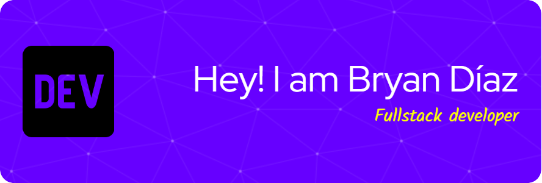

# 💫 About Me:
 Hi! I'm Bryan Díaz, a Computer Systems Engineering student at the University of El Salvador.
I'm building my path in the world of Full Stack Development, with a strong interest in projects that combine frontend, backend, and database technologies.
Here you'll find some of my academic and personal projects, where I apply what I learn every day as I prepare to bring real value to the tech industry.

## 🌐 Socials:
  

# 💻 Tech Stack:
             

<!-- Proudly created with GPRM ( https://gprm.itsvg.in ) -->
